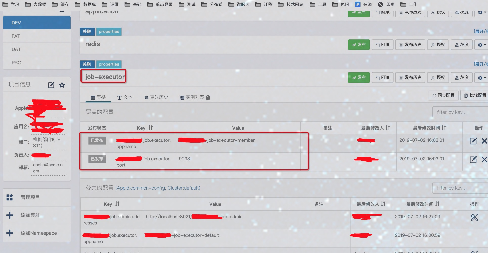
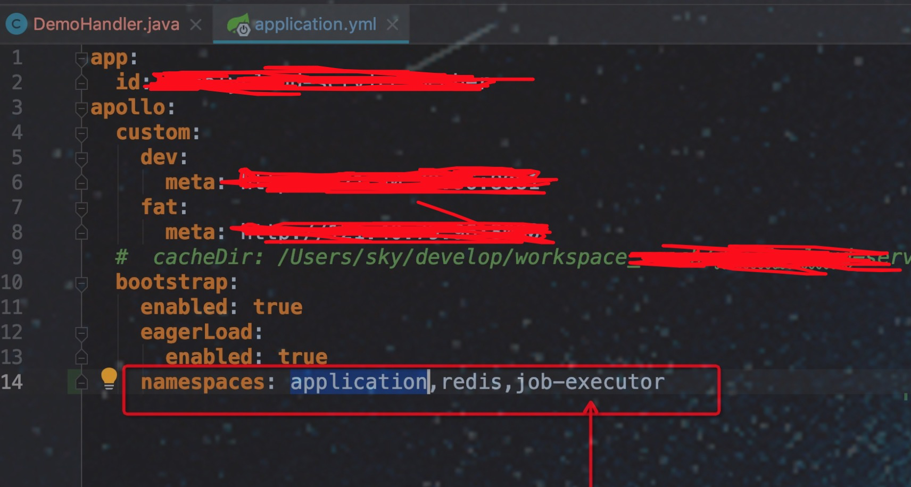
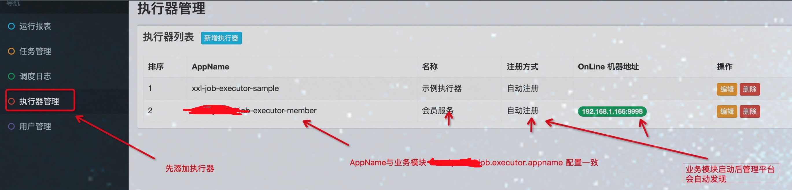
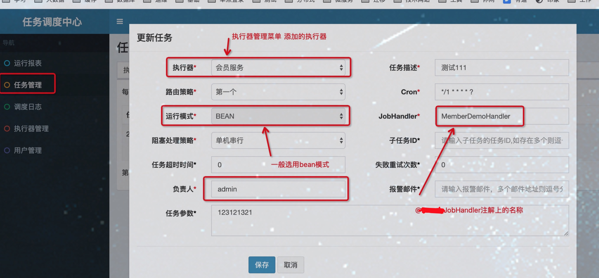

使用步骤:
=====
1): 引入如下包
```

<dependency>
    <groupId>com.sky.framework</groupId>
    <artifactId>framework-integrate-job</artifactId>
</dependency>

```
    
2): 配置中心关联全局定时器 job-executor ,并覆盖如下红框属性
skycloud.job.executor.appname = skycloud-job-executor-名称
skycloud.job.executor.port = 端口号




3): 开发模块中配置加载namespace




4): 开发业务代码


5): 登录任务管理平台添加任务







整合xxl-job地址:<a href="http://www.xuxueli.com/xxl-job/#/" target="_blank">xxl-job</a>
=====