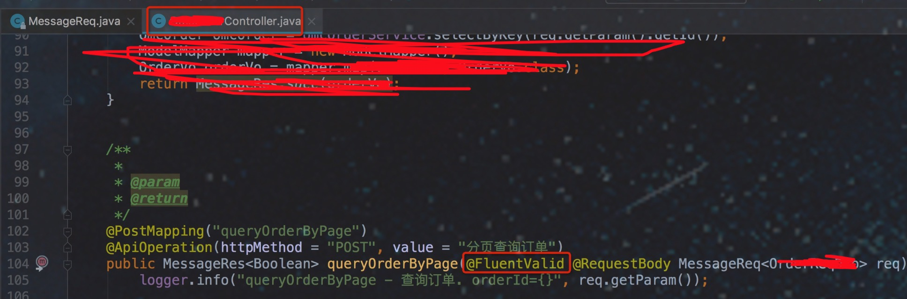

使用步骤:
=====
1): 引入如下包
```
如果有 framework-web 包则 跳过此步骤

<dependency>
    <groupId>com.sky.framework</groupId>
    <artifactId>framework-integrate-validator</artifactId>
</dependency>

```
    
2): 配置验证器要拦截的目标类(此处为拦截以Controller与ServiceImpl结尾的类)
在配置中心配置验证器
```
#参数验证器
validator.bean-names = *Controller , *ServiceImpl

```

    
3): 需要编写的业务验证代码



整合验证器为:<a href="https://github.com/neoremind/fluent-validator" target="_blank">fluent-validator</a>
=====