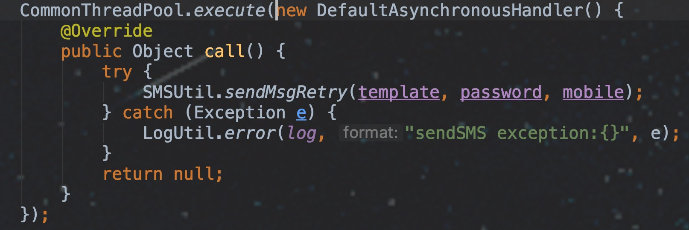

使用步骤:
=====
1): 引入如下包
```

<dependency>
    <groupId>com.sky.framework</groupId>
    <artifactId>framework-util-threadpool</artifactId>
</dependency>

```
    
2): 配置自定义属性（可省略）

IDEA下,在yml文件中填写 asyncthreadpool 会自动提示配置项

请根据自己模块定制化配置(如果需要)


3): 代码编写方式




